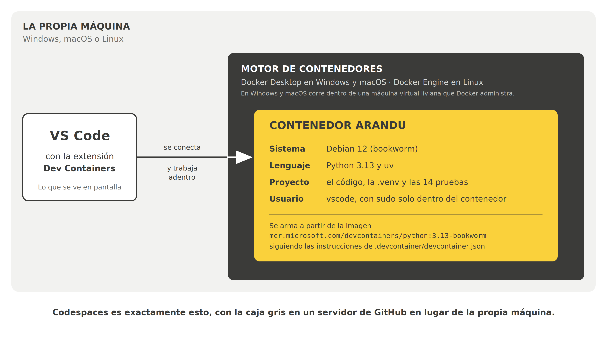
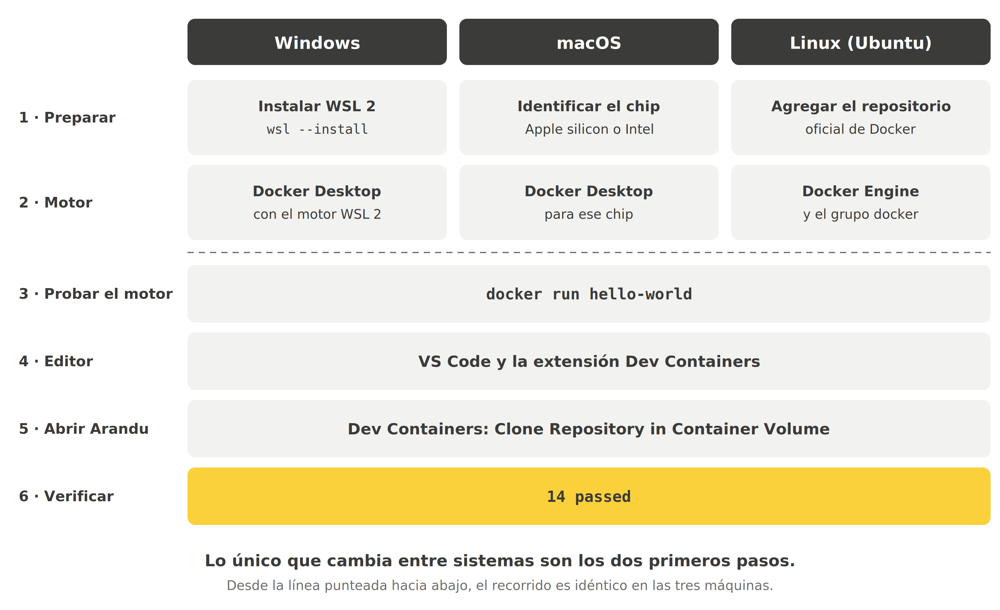

# Arandu en la propia máquina

**Guía de instalación del entorno local, paso a paso, para Windows, macOS y Linux**
Taller IV · Desarrollo Personal · Análisis de Sistemas · UCOM

Tiempo estimado: entre 30 y 60 minutos la primera vez, casi todo esperando descargas.
Las veces siguientes, abrir el proyecto tarda segundos.

---

## Antes de empezar: ¿hace falta esta guía?

No es obligatoria. Hay tres formas de trabajar con Arandu, y las tres sirven para el taller:

| Camino | Qué requiere | A favor | En contra |
|---|---|---|---|
| **Codespaces** | Solo un navegador y una cuenta de GitHub | No se instala nada | Necesita internet todo el tiempo y consume la cuota gratuita de horas |
| **Contenedor local** (esta guía) | Docker y VS Code instalados | Mismo entorno que Codespaces, sin cuota; funciona sin internet una vez construido | Hay que instalar un motor de contenedores y reservarle memoria |
| **Sin contenedor** | Python 3.13 y uv instalados a mano | Lo más liviano | El entorno puede diferir del de la cátedra; si algo falla, cuesta saber si es el código o la máquina |

Esta guía es para el segundo camino: correr **exactamente el mismo contenedor** que usa
Codespaces, pero en la computadora propia.

---

## Qué se va a instalar, y por qué



Cuatro conceptos, en el orden en que aparecen en el diagrama:

- **Imagen.** Un paquete de solo lectura con un sistema operativo y programas ya instalados.
  Arandu usa `mcr.microsoft.com/devcontainers/python:3.13-bookworm`: Debian 12 con
  Python 3.13, publicada por Microsoft para este fin. Tiene versiones para procesadores
  x86-64 y ARM, así que funciona igual en una PC común y en una Mac con chip Apple.
- **Contenedor.** Una instancia en ejecución de esa imagen. Es donde efectivamente corre
  el código. Si se rompe, se tira y se crea otro igual.
- **Motor de contenedores.** El programa que descarga imágenes y ejecuta contenedores.
  En Windows y macOS es **Docker Desktop**, que por debajo levanta una máquina virtual
  liviana con Linux. En Linux es **Docker Engine**, que corre directamente sobre el sistema.
- **La extensión Dev Containers de VS Code.** Lee el archivo `.devcontainer/devcontainer.json`
  del proyecto, le pide al motor que arme el contenedor, y conecta el editor para que
  todo lo que se escribe, se ejecuta o se prueba ocurra **adentro**.

La idea central es la última línea del diagrama: **Codespaces es exactamente esto**, con el
motor de contenedores en un servidor de GitHub. Por eso el archivo `devcontainer.json` es el
mismo en los dos casos, y por eso el resultado final también es el mismo: `14 passed`.

---

## El recorrido completo



Lo único que cambia entre sistemas son los pasos 1 y 2: preparar la máquina e instalar el
motor. Del paso 3 en adelante, el recorrido es idéntico en las tres.

Ir directo a la sección que corresponde:

- [Windows](#windows)
- [macOS](#macos)
- [Linux (Ubuntu)](#linux-ubuntu)
- [Pasos comunes: del editor a los 14 passed](#pasos-comunes-del-editor-a-los-14-passed)

---

## Windows

### Requisitos

| Qué | Mínimo |
|---|---|
| Sistema | Windows 10 versión 22H2 (compilación 19045) o Windows 11 versión 23H2 (compilación 22631) o posterior |
| Edición | Pro, Enterprise, Education o Home. La edición Home solo ejecuta contenedores Linux, que es justamente lo que usa Arandu |
| Memoria | 8 GB de RAM |
| Procesador | 64 bits, con la virtualización habilitada en la BIOS o UEFI |

**Cómo comprobarlo:**

- **Versión de Windows:** tecla Windows + R, escribir `winver` y Enter. La ventana muestra
  la versión y la compilación.
- **Virtualización:** abrir el Administrador de tareas (Ctrl + Shift + Esc), pestaña
  **Rendimiento**, elegir **CPU**. Abajo a la derecha debe decir **Virtualización: Habilitado**.
  Si dice *Deshabilitado*, hay que activarla en la BIOS; el nombre de la opción depende del
  fabricante (suele llamarse *Intel VT-x*, *Intel Virtualization Technology* o *AMD-V / SVM*).

### Paso 1 · Instalar WSL 2

WSL (Windows Subsystem for Linux) es lo que permite a Windows ejecutar Linux. Docker Desktop
lo usa como base.

1. Abrir el menú Inicio, escribir **PowerShell**, hacer clic derecho sobre
   *Windows PowerShell* y elegir **Ejecutar como administrador**.
2. Escribir:

   ```powershell
   wsl --install
   ```

3. Esperar a que termine y **reiniciar la computadora**.
4. Después del reinicio se abre una ventana de Ubuntu que pide crear un usuario y una
   contraseña de Linux. Son independientes de la cuenta de Windows; conviene anotarlos.
5. Comprobar la versión, en una PowerShell común:

   ```powershell
   wsl --version
   ```

   La línea *Versión de WSL* debe ser **2.1.5 o superior**. Si es menor:

   ```powershell
   wsl --update
   ```

### Paso 2 · Instalar Docker Desktop

1. Descargar el instalador desde la página oficial:
   [docs.docker.com/desktop/setup/install/windows-install](https://docs.docker.com/desktop/setup/install/windows-install/).
2. Ejecutar **Docker Desktop Installer.exe** con doble clic.
3. En la pantalla de configuración, dejar marcada la opción
   **Use WSL 2 instead of Hyper-V** (si aparece).
4. Seguir el asistente hasta el final y elegir **Close**.
5. Abrir **Docker Desktop** desde el menú Inicio y aceptar los términos de uso.
   Si ofrece iniciar sesión con una cuenta de Docker, se puede omitir: Arandu no la necesita.
6. En Docker Desktop, abrir **Settings** (ícono de engranaje) → **General** y confirmar
   que está marcada **Use the WSL 2 based engine**.

Esperar a que el ícono de la ballena, abajo a la derecha, deje de moverse: significa que el
motor está listo.

### Paso 3 · Probar el motor

En una PowerShell común (no hace falta que sea de administrador):

```powershell
docker run hello-world
```

Si aparece un texto que empieza con **Hello from Docker!**, el motor funciona.
Continuar con los [pasos comunes](#pasos-comunes-del-editor-a-los-14-passed).

---

## macOS

### Requisitos

| Qué | Mínimo |
|---|---|
| Sistema | La versión actual de macOS o cualquiera de las dos anteriores |
| Memoria | 4 GB de RAM |
| Procesador | Chip Apple (M1 o posterior) o Intel |

### Paso 1 · Identificar el chip

Menú Apple (la manzana, arriba a la izquierda) → **Acerca de esta Mac**. La ventana dice una de estas dos cosas:

- **Chip: Apple M…** → hay que descargar la versión para *Apple silicon*.
- **Procesador: … Intel …** → hay que descargar la versión para *Intel chip*.

Descargar la versión equivocada es el error más común en Mac.

### Paso 2 · Instalar Docker Desktop

1. Descargar el instalador que corresponde al chip desde la página oficial:
   [docs.docker.com/desktop/setup/install/mac-install](https://docs.docker.com/desktop/setup/install/mac-install/).
2. Abrir el archivo **Docker.dmg** con doble clic y arrastrar el ícono de Docker a la
   carpeta **Aplicaciones**.
3. Abrir **Docker** desde Aplicaciones.
4. Aceptar los términos de uso (**Accept**).
5. Elegir **Use recommended settings** e ingresar la contraseña de la Mac cuando la pida.
6. Elegir **Finish**. Si ofrece iniciar sesión con una cuenta de Docker, se puede omitir.

Esperar a que el ícono de la ballena en la barra de menú deje de moverse.

> **Sobre Rosetta 2.** En Macs con chip Apple, Docker la recomienda pero ya no la exige.
> Arandu no la necesita, porque su imagen tiene versión nativa para ARM.

### Paso 3 · Probar el motor

Abrir la aplicación **Terminal** y escribir:

```bash
docker run hello-world
```

Si aparece un texto que empieza con **Hello from Docker!**, el motor funciona.
Continuar con los [pasos comunes](#pasos-comunes-del-editor-a-los-14-passed).

---

## Linux (Ubuntu)

Estos pasos son para **Ubuntu 22.04, 24.04 o 26.04**. Para otras distribuciones, la página
oficial tiene instrucciones propias:
[docs.docker.com/engine/install](https://docs.docker.com/engine/install/).

En Linux no se usa Docker Desktop sino **Docker Engine**, que es más liviano porque no
necesita una máquina virtual.

### Paso 1 · Agregar el repositorio oficial de Docker

Ubuntu trae un paquete de Docker propio, pero suele estar atrasado. Se usa el repositorio
de Docker. Copiar y pegar en una terminal, **tal cual**, un bloque por vez:

```bash
# La llave con la que se verifican los paquetes
sudo apt update
sudo apt install ca-certificates curl
sudo install -m 0755 -d /etc/apt/keyrings
sudo curl -fsSL https://download.docker.com/linux/ubuntu/gpg -o /etc/apt/keyrings/docker.asc
sudo chmod a+r /etc/apt/keyrings/docker.asc
```

```bash
# El repositorio
sudo tee /etc/apt/sources.list.d/docker.sources <<EOF
Types: deb
URIs: https://download.docker.com/linux/ubuntu
Suites: $(. /etc/os-release && echo "${UBUNTU_CODENAME:-$VERSION_CODENAME}")
Components: stable
Architectures: $(dpkg --print-architecture)
Signed-By: /etc/apt/keyrings/docker.asc
EOF

sudo apt update
```

### Paso 2 · Instalar Docker Engine y habilitar el uso sin sudo

```bash
sudo apt install docker-ce docker-ce-cli containerd.io docker-buildx-plugin docker-compose-plugin
```

Por defecto, Docker solo se puede usar con `sudo`. VS Code necesita usarlo sin `sudo`, así que
hay que agregar el usuario al grupo `docker`:

```bash
sudo groupadd docker          # si dice que el grupo ya existe, está bien
sudo usermod -aG docker $USER
```

Después, **cerrar la sesión de Linux y volver a entrar** (o reiniciar). Sin este paso el
cambio de grupo no tiene efecto.

> **Advertencia de seguridad.** Pertenecer al grupo `docker` equivale a tener permisos de
> administrador sobre la máquina. En una computadora personal es lo habitual; en una
> compartida, conviene consultarlo antes.

### Paso 3 · Probar el motor

Ya sin `sudo`:

```bash
docker run hello-world
```

Si aparece un texto que empieza con **Hello from Docker!**, el motor funciona.

---

## Pasos comunes: del editor a los 14 passed

Desde acá, las instrucciones son las mismas en los tres sistemas. Donde dice
**Ctrl + Shift + P**, en Mac es **Cmd + Shift + P**.

### Paso 4 · VS Code y la extensión Dev Containers

1. Si no está instalado, descargar VS Code desde
   [code.visualstudio.com](https://code.visualstudio.com/).
2. Abrir VS Code, ir a la vista de **Extensiones** (Ctrl + Shift + X), buscar
   **Dev Containers** e instalar la publicada por **Microsoft**.
   Su identificador es `ms-vscode-remote.remote-containers`.

### Paso 5 · Abrir Arandu dentro del contenedor

1. Confirmar que el motor está corriendo (en Windows y macOS, Docker Desktop abierto y con
   la ballena quieta).
2. En VS Code, abrir la paleta de comandos con **Ctrl + Shift + P** y escribir:

   ```
   Dev Containers: Clone Repository in Container Volume...
   ```

3. Pegar la dirección del repositorio y Enter:

   ```
   https://github.com/talleres-ucom/arandu
   ```

4. Esperar. La primera vez, VS Code:
   - descarga la imagen base (es la parte más lenta; depende de la conexión),
   - crea el contenedor,
   - instala las extensiones de Python dentro del contenedor,
   - ejecuta el comando de preparación del proyecto: instala uv, instala las dependencias
     y corre las pruebas.

   Para seguir el avance, hacer clic en **show log** en la notificación de abajo a la derecha,
   o ejecutar desde la paleta `Dev Containers: Show Container Log`.

> **Por qué «Clone Repository in Container Volume» y no clonar como siempre.** Esta opción
> guarda el código dentro de un *volumen* de Docker en lugar de una carpeta común. En Windows
> y macOS eso es notablemente más rápido, porque el contenedor no tiene que cruzar la frontera
> con el sistema anfitrión en cada lectura de archivo. En Windows evita, además, el problema de
> los finales de línea: el repositorio lo clona Git dentro de Linux, con finales LF, y no aparecen
> archivos «modificados» que en realidad no cambiaron.

### Paso 6 · Verificar

Tres comprobaciones, en la terminal integrada de VS Code (menú **Terminal → New Terminal**):

```bash
python --version      # debe decir Python 3.13.x
whoami                # debe decir vscode
uv run pytest -q      # debe terminar en 14 passed
```

Y una comprobación visual: abajo a la izquierda, la barra de estado de VS Code muestra un
recuadro de color que dice **Dev Container: Arandu**. Ese recuadro es la señal de que el
editor está trabajando **dentro** del contenedor y no en la máquina.

**Si las tres comprobaciones dan lo esperado, el entorno está listo.** Es el mismo resultado
que da Codespaces.

---

## Uso diario

**Volver a abrir el proyecto.** En VS Code, **File → Open Recent**: la entrada de Arandu
aparece identificada como Dev Container. La segunda vez no descarga nada y abre en segundos.

**Dónde quedan los archivos.** Dentro del volumen de Docker, no en una carpeta visible desde
el Explorador de Windows o el Finder. Esto tiene una consecuencia importante:

> **El trabajo se guarda con commit y push.** Si se borra el volumen, se pierde todo lo que
> no se haya subido a GitHub. Conviene hacer push al terminar cada sesión de trabajo.

Para hacer push desde el contenedor no hace falta configurar nada nuevo: VS Code copia al
contenedor la configuración de Git de la máquina (nombre y correo), reutiliza el administrador
de credenciales si se trabaja por HTTPS, y reenvía el agente SSH si se trabaja con llaves.
Si Git ya funcionaba con GitHub en la computadora, funciona igual adentro del contenedor.

**Cerrar.** Al cerrar la ventana de VS Code, el contenedor se detiene: es el comportamiento
por defecto de los contenedores definidos por imagen. En Windows y macOS
se puede cerrar también Docker Desktop (clic en la ballena → **Quit Docker Desktop**) para
liberar la memoria que reserva.

**Si el proyecto cambia su entorno.** Si la cátedra actualiza el `devcontainer.json`, hay que
reconstruir: **Ctrl + Shift + P** → `Dev Containers: Rebuild Container`. Se avisa en clase
cuando corresponda.

---

## Problemas frecuentes

| Síntoma | Causa probable | Qué hacer |
|---|---|---|
| `docker: command not found`, o *Cannot connect to the Docker daemon* | El motor no está corriendo | Windows y macOS: abrir Docker Desktop y esperar a que la ballena se quede quieta. Linux: `sudo systemctl start docker` |
| *permission denied while trying to connect to the Docker daemon socket* (Linux) | El usuario no está en el grupo `docker`, o no se cerró la sesión después de agregarlo | Repetir el paso 2 de Linux y **cerrar sesión** |
| Docker Desktop no arranca y menciona WSL (Windows) | WSL no está instalado o está desactualizado | `wsl --version`; si es menor a 2.1.5, `wsl --update` y reiniciar |
| Docker Desktop menciona virtualización (Windows) | La virtualización está deshabilitada en la BIOS | Activarla en la BIOS; ver la sección de requisitos de Windows |
| El instalador no abre, o Docker no arranca (Mac) | Puede haberse descargado la versión para el otro chip | Volver al paso 1 de macOS y comparar con lo descargado |
| La primera apertura tarda mucho | Está descargando la imagen base | Es normal. Las siguientes aperturas tardan segundos |
| `uv: command not found` dentro del contenedor | Falló el comando de preparación | Revisar el registro con `Dev Containers: Show Container Log`; después, `Dev Containers: Rebuild Container` |
| Algo distinto de `14 passed` | El entorno no quedó igual al de la cátedra | Anotar el mensaje exacto y consultarlo en la clínica del miércoles |
| Nada de lo anterior funciona | — | Usar Codespaces mientras tanto. El taller no depende de tener el entorno local |

---

## Fuentes

Toda la información de instalación se tomó de la documentación oficial, verificada en
septiembre de 2026. Si algo de esta guía no coincide con lo que se ve en pantalla, **manda la
documentación oficial**: los instaladores cambian más rápido que las guías.

- Docker — *Install Docker Desktop on Windows* ·
  https://docs.docker.com/desktop/setup/install/windows-install/
- Docker — *Install Docker Desktop on Mac* ·
  https://docs.docker.com/desktop/setup/install/mac-install/
- Docker — *Install Docker Engine on Ubuntu* ·
  https://docs.docker.com/engine/install/ubuntu/
- Docker — *Linux post-installation steps for Docker Engine* ·
  https://docs.docker.com/engine/install/linux-postinstall/
- Docker — *Docker Desktop license agreement* (gratuito para uso personal y educativo) ·
  https://docs.docker.com/subscription/desktop-license/
- Microsoft — *How to install Linux on Windows with WSL* ·
  https://learn.microsoft.com/windows/wsl/install
- VS Code — *Developing inside a Container* ·
  https://code.visualstudio.com/docs/devcontainers/containers
- VS Code — *Sharing Git credentials with your container* ·
  https://code.visualstudio.com/remote/advancedcontainers/sharing-git-credentials
- VS Code — *Dev Containers tips and tricks* (finales de línea, registros) ·
  https://code.visualstudio.com/docs/devcontainers/tips-and-tricks
- Development Containers — referencia de `devcontainer.json` (`shutdownAction`) ·
  https://containers.dev/implementors/json_reference/
- Dev Containers — imagen de Python (arquitecturas disponibles) ·
  https://github.com/devcontainers/images/tree/main/src/python
